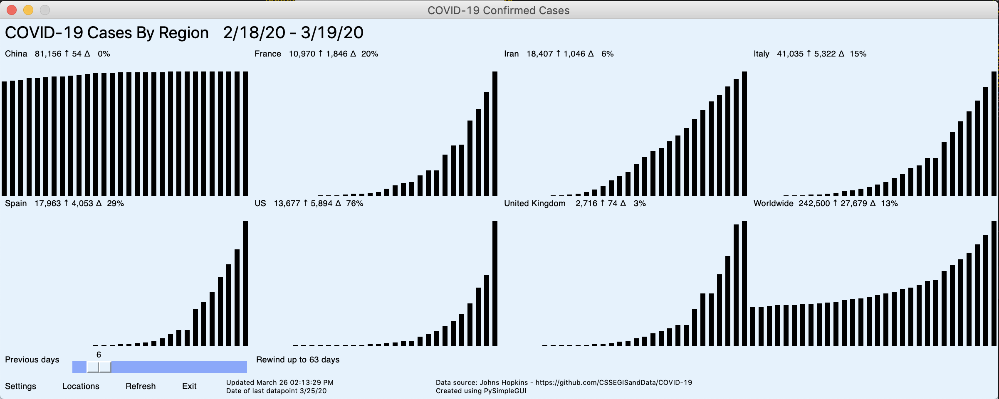

# Analyzing COVID19 (Novel Coronavirus) data

Viewing data graphically to understand the impact of the Novel Coronavirus country-wise over time and get the big picture with information involving the number of new confirmed cases, deaths and the % increase in the value.

## Background

**Coronavirus disease 2019 (COVID-19)** is an infectious disease caused by **severe acute respiratory syndrome coronavirus 2 (SARS-CoV-2)**.<br>
The disease was first identified in 2019 in Wuhan, the capital of Hubei, China, and has since spread globally, resulting in the 2019–20 coronavirus pandemic.
As the COVID-19 has huge potential implications, this project gives a preliminary platform to dive into the available data and gain insights.

---

## Data

### Source

John Hopkins University CSSE [Novel Coronavirus (COVID-19) Cases data](https://systems.jhu.edu/research/public-health/ncov/): https://github.com/CSSEGISandData/COVID-19

*Bias*: Selection bias on confirmed over those tested, as there are discriminatory forces that determine who gets tested - age, availability, price/demographic, and so on. These factors can change with time. Further, multiple countries are investing heavily to make the tests more available them, which also affects the report.

### Tracking

Covid Tracking Projects: https://covidtracking.com

Keywords
```
#COVID19
#covid19
#coronavirus
#CoronaVirus
#coronavirustexas
#Coronavirustexas
#coronavirusnewyork
#coronaviruscalifornia
```
---

## Requirements

* *PySimpleGUI*: for GUI
* *geopy*: to run the distance widget (from the PSG-Widgets repository)

```bash
pip3 install -r requirements.txt
```

* *PySimpleGUI-exemaker*: (Optional) to make executable GUI using *pyinstaller*.[Reference](https://github.com/PySimpleGUI/PySimpleGUI/tree/master/exemaker)

---

## Configuration and Graphs

* settings
  * confirmed cases or deaths
  * autoscaled or absolute value
  * number of days to display


* locations
  * country list
  * *NOTE*: no, of countries must be equal to no. of graphs


Saved in ***app.cfg***

* graphs
  * bar plot of number cases
  * day-wise, max upto 63 previous days
  * country/region wise
  * shows change in percentage



---

## Sample Report based on preliminary analysis

[coronavirus_timeseries.R](src/coronavirus_timeseries.R)

### 03-25-2020

#### China: Cumulative cases by provinces over time, starting 10-Feb-2020
The curve appears to be flattening, which is good.


#### China: New cases by provinces over time, starting 10-Feb-2020
Very few or no new cases, which is good.


#### Hubei, China: New cases over time, starting 10-Feb-2020
Three major spikes followed by a consistent drop, which is good.


#### USA: Cumulative cases over time, starting 10-Mar-2020
The curve exponentially increasing, which is concerning.


#### USA: New cases over time, starting 10-Mar-2020
The curve increasing, but slower which is still concerning, with a glimmer of hope.


---

## More information

[WHO](https://www.who.int/emergencies/diseases/novel-coronavirus-2019)

[Download daily PDF files](https://www.who.int/emergencies/diseases/novel-coronavirus-2019/situation-reports) that have the "Situation Report" for the most up to date information.

---

## Credits

PySimpleGUI.com

GUI tool based on the [PySimpleGUI-COVID19](https://github.com/PySimpleGUI/PySimpleGUI-COVID19) project.
